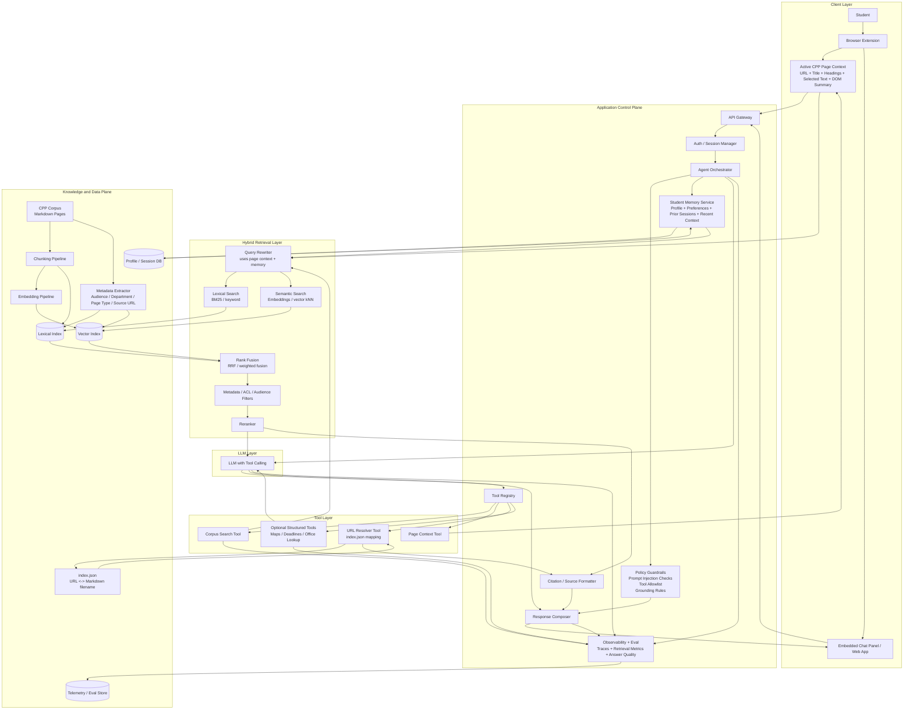
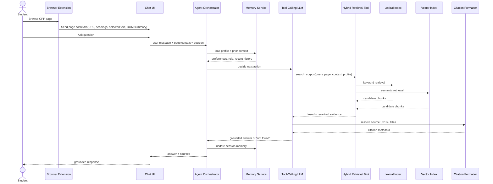
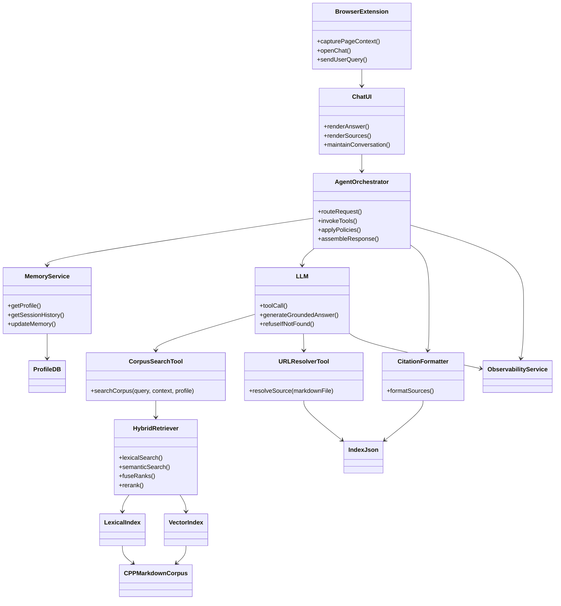

# Cal Poly Pomona Campus Knowledge Agent
## UML Diagram Planning Guide for Team Proposal

## Purpose

This document explains the UML-style architecture diagrams for the Cal Poly Pomona campus knowledge assistant. It is written to align the team on:

- what the full system includes
- how the browser extension, chatbot, retrieval system, and student memory work together
- which components belong in the MVP versus later phases
- how the diagrams map to engineering workstreams for the planning proposal

This architecture is based on the project requirements for a campus knowledge agent that uses tool calling, corpus search, grounded responses, source attribution, and multi-turn conversation over the CPP website corpus. It also follows the recommended system pattern of **Hybrid RAG** plus **tool-augmented orchestration** with **student memory kept separate from corpus truth**.

---

## System summary

The proposed product is a Chrome extension and side-panel web app that helps students navigate the Cal Poly Pomona website. The assistant should:

- understand the page the student is currently viewing
- answer questions using the CPP Markdown corpus
- cite the source pages it used
- retain conversation context across turns
- optionally personalize ranking and suggestions using a student profile and session history
- say when an answer cannot be verified from the corpus

The system is not a generic chatbot. It is a **grounded campus navigation assistant**.

---

## The diagrams covered in this guide

This guide explains three diagrams:

1. **Total system architecture diagram**
   - shows the entire product stack
   - best for executive and planning discussions

2. **Runtime sequence diagram**
   - shows what happens when a student asks a question
   - best for backend and UX flow alignment

3. **Strict UML component/class-style diagram**
   - shows the major software objects and dependencies
   - best for implementation planning and service boundaries

---

# 1. Total system architecture diagram

## Diagram

## What this diagram represents

This is the **big-picture architecture**. It shows every major subsystem needed to power the assistant, from the browser extension UI to the retrieval engine and LLM.

The diagram is organized into six layers:

- client layer
- control plane
- tool layer
- retrieval layer
- data/knowledge plane
- model layer

This is the best diagram to use in the proposal when explaining the total product.

## Layer-by-layer explanation

### Client layer

This is what the student sees and interacts with.

**Browser Extension**
- entry point into the experience
- lives inside Chrome
- can show the floating mascot widget, context helper, and side panel

**Embedded Chat Panel / Web App**
- main interface for chat, suggestions, and dashboard elements
- receives answers and sources from the backend

**Active CPP Page Context**
- captures what the student is currently looking at
- includes URL, page title, headings, selected text, and page summary
- this is a major differentiator from a normal chatbot

**Student**
- the end user
- drives the whole system through browsing and asking questions

### Application control plane

This is the system’s decision-making and orchestration layer.

**API Gateway**
- receives requests from the extension or web app
- central entry point for backend services

**Auth / Session Manager**
- manages the current session
- keeps track of conversation state and user identity if implemented

**Agent Orchestrator**
- the central brain of the application
- decides which tools to call
- manages flow between user input, retrieval, LLM reasoning, and final response generation

**Policy Guardrails**
- enforces system rules
- blocks unsafe or irrelevant tool usage
- ensures the assistant answers from retrieved sources rather than inventing information

**Student Memory Service**
- stores profile and session context
- used for personalization and better ranking
- does not replace source-backed truth from the corpus

**Tool Registry**
- list of tools the LLM/orchestrator is allowed to use
- keeps tool calling bounded and auditable

**Citation / Source Formatter**
- maps retrieved chunks back to their original CPP page title and URL
- prepares source chips or citation cards for the UI

**Response Composer**
- assembles the final answer object sent to the frontend
- combines text, sources, confidence, and suggested next actions

**Observability + Eval**
- tracks tool calls, retrieval quality, latency, and answer quality
- helps judge whether the system is improving or regressing

### Tool layer

This layer exists because the project requires **tool calling**.

**Corpus Search Tool**
- runs retrieval over the CPP corpus
- the most important tool in the system

**Page Context Tool**
- exposes current-page details to the agent
- helps answer questions like “what do I do on this page?”

**URL Resolver Tool**
- uses `index.json` to map Markdown documents back to official URLs
- required for clean source attribution

**Optional Structured Tools**
- future tools for more deterministic lookups
- examples: office directory, map lookup, deadlines table
- not required for MVP

### Hybrid retrieval layer

This is the core RAG engine.

**Query Rewriter**
- rewrites vague or follow-up questions into better retrieval queries
- uses page context and memory to resolve questions like “Who do I contact here?”

**Lexical Search**
- keyword/BM25-style retrieval
- good for exact office names, acronyms, and specific phrases

**Semantic Search**
- embedding/vector search
- good for natural-language questions and paraphrases

**Rank Fusion**
- combines lexical and semantic result lists
- this is what makes the system hybrid instead of lexical-only or vector-only

**Metadata / ACL / Audience Filters**
- narrows or boosts results based on audience, page type, current page, and other rules

**Reranker**
- takes the best fused candidates and reorders them for answer quality
- final step before evidence is given to the LLM

### Knowledge and data plane

This is the system’s stored knowledge and index infrastructure.

**CPP Corpus**
- all scraped CPP Markdown pages
- the source of truth for retrieval

**index.json**
- mapping between source URLs and Markdown filenames
- essential for citations and reverse lookup

**Chunking Pipeline**
- splits long pages into smaller retrieval units
- improves retrieval precision

**Embedding Pipeline**
- generates vector representations for chunks
- powers semantic retrieval

**Metadata Extractor**
- adds useful structured fields like department, audience, page type, and source URL

**Lexical Index**
- search index for keyword retrieval

**Vector Index**
- search index for embeddings

**Profile / Session DB**
- stores student profile and interaction history

**Telemetry / Eval Store**
- stores logs, metrics, and evaluation results

### Model layer

**LLM with Tool Calling**
- not treated as the source of truth
- used to plan tool usage and synthesize grounded answers from evidence
- should not answer from memory alone

## Why this diagram matters for planning

This diagram helps the team separate the system into workstreams:

- frontend extension/UI
- backend orchestration
- retrieval/indexing pipeline
- LLM integration
- memory/profile service
- analytics/evaluation

It also clarifies that the product is not only “a chatbot.” It is a coordinated system with a UI, search engine, tools, and policy layer.

## MVP interpretation

For the MVP, these parts are essential:

- browser extension or web chat shell
- API gateway/backend
- agent orchestrator
- corpus search tool
- query rewriting
- lexical + semantic retrieval
- reranking
- citation formatting
- CPP corpus + index.json

These parts can be reduced or deferred:

- advanced profile memory
- structured tools
- deep analytics dashboard
- heavy personalization
- complex multi-agent councils

---

# 2. Runtime sequence diagram

## Diagram

## What this diagram represents

This diagram shows the **runtime path of a single question**.

It answers the planning question:

**What actually happens, step by step, when a student asks the system for help?**

This is the best diagram for explaining backend flow and latency-sensitive dependencies.

## Step-by-step explanation

### 1. Student browses a CPP page
The student is already on a CPP webpage. This is important because the assistant is context-aware.

### 2. Extension captures page context
The extension extracts contextual information such as:
- current URL
- headings
- selected text
- DOM summary

This turns the assistant into a page-aware navigator rather than a general-purpose chat box.

### 3. Student asks a question
The student may ask something direct or vague:
- “What does this office do?”
- “Who do I contact here?”
- “What should I do next?”

### 4. Chat UI sends full request to orchestrator
The request includes:
- user message
- current page context
- current conversation state

### 5. Orchestrator loads memory
The orchestrator optionally loads:
- student profile
- recent pages
- previous questions

This is used for personalization and follow-up disambiguation.

### 6. Orchestrator asks the LLM what action to take
The LLM is not directly answering yet. It is deciding what tool call is needed.

### 7. LLM calls the search tool
The most important action is a retrieval call over the corpus.

### 8. Search tool performs hybrid retrieval
The search tool runs:
- lexical retrieval against the keyword index
- semantic retrieval against the vector index

### 9. Candidate chunks are fused and reranked
The search tool merges both result sets and returns the best evidence.

### 10. LLM requests citation metadata
The assistant needs the official page title and source URL, not just raw chunk text.

### 11. LLM produces a grounded answer or abstains
The assistant should either:
- answer using retrieved evidence
- or say the answer could not be confirmed

This is a critical trust requirement.

### 12. Orchestrator updates session memory
The system can remember:
- this question
- retrieved pages
- recent conversation context

### 13. Final answer returns to the student
The chat UI displays:
- answer text
- sources
- follow-up options
- possibly next steps

## Why this diagram matters for planning

This diagram identifies the **critical runtime dependencies**:

- frontend cannot answer without backend orchestration
- orchestrator depends on search quality
- search depends on both lexical and vector indexes
- answer quality depends on reranking and citation formatting

It also reveals the major latency contributors:

- search execution
- reranking
- LLM synthesis

This helps the team plan performance priorities.

## Failure points revealed by the sequence

This diagram exposes where the system can fail:

- extension captures poor page context
- follow-up resolution is incorrect
- retrieval misses the right page
- citation mapping breaks
- LLM overgeneralizes beyond evidence

These become direct testing targets.

---

# 3. Strict UML component/class-style diagram

## Diagram

## What this diagram represents

This is a more implementation-oriented view. It treats the main parts of the application as software components with functions and dependencies.

This diagram is useful when deciding:

- what services/classes/modules need to exist
- which components own which responsibilities
- where interfaces should be cleanly separated

## Component-by-component explanation

### BrowserExtension
Owns browser-specific behavior.

Responsibilities:
- capture current page data
- open/close side panel
- pass requests to chat UI/backend

### ChatUI
Owns user presentation.

Responsibilities:
- display chat
- render citations and cards
- maintain visible message history

### AgentOrchestrator
Most important backend service.

Responsibilities:
- receive request
- decide tool flow
- apply policies
- assemble the final output

This is the component that prevents the app from devolving into an unstructured single prompt.

### MemoryService
Separate personalization service.

Responsibilities:
- read profile
- read session history
- update recent context

Important architectural rule:
- memory supports relevance and UX
- memory is not evidence

### CorpusSearchTool
Formal interface between the LLM/orchestrator and the corpus retrieval engine.

Responsibilities:
- accept search query plus context
- return ranked evidence chunks with source metadata

### URLResolverTool
Utility tool for recovering official page links from the corpus files.

Responsibilities:
- resolve Markdown artifact back to original page URL

### HybridRetriever
Main retrieval engine.

Responsibilities:
- lexical search
- semantic search
- fusion
- reranking

This component is where the “Hybrid RAG” claim becomes real.

### LexicalIndex and VectorIndex
Storage/query backends for the two retrieval modes.

### CitationFormatter
Converts retrieved results into UI-friendly citations.

Responsibilities:
- create source chips/cards
- attach page titles and links

### LLM
Reasoning and synthesis layer.

Responsibilities:
- choose tools
- synthesize answer from evidence
- refuse unsupported answers

### CPPMarkdownCorpus and IndexJson
Knowledge base assets.

### ProfileDB
Stores user profile and session context.

### ObservabilityService
Records telemetry and quality data.

## Why this diagram matters for planning

This diagram is useful for defining team ownership.

Possible ownership split:

- **Frontend / Extension**
  - BrowserExtension
  - ChatUI

- **Backend / Agent**
  - AgentOrchestrator
  - CorpusSearchTool
  - URLResolverTool
  - CitationFormatter

- **Retrieval / Data**
  - HybridRetriever
  - LexicalIndex
  - VectorIndex
  - CPPMarkdownCorpus
  - IndexJson

- **Product Intelligence / Personalization**
  - MemoryService
  - ProfileDB

- **Infra / QA**
  - ObservabilityService

This diagram is the best one to use when planning sprints and code boundaries.

---

# Cross-diagram interpretation

## How the three diagrams fit together

### Architecture diagram
Explains **what exists** in the system.

### Sequence diagram
Explains **what happens during a user interaction**.

### Component/class-style diagram
Explains **what software modules own those responsibilities**.

Used together, they answer three different planning questions:

- What is the system made of?
- How does a request move through it?
- Which modules/services must the team build?

---

# Proposal-ready planning notes

## Recommended MVP scope

### Include in proposal MVP
- Chrome extension or browser-side entry point
- side-panel chat UI
- current-page context extraction
- corpus ingestion from Markdown
- hybrid retrieval using lexical + semantic search
- reranking
- one orchestrator service
- one tool-called corpus search function
- source citation display
- follow-up conversation context

### Mention as phase 2, not MVP
- advanced long-term memory
- structured deadline/office databases
- analytics dashboard for admins
- agent council / multi-agent debate
- personalized proactive nudges across sessions
- external web search fallback

## Suggested workstreams

### Workstream 1: frontend and extension
- floating widget
- chat panel
- source chips/cards
- page-context capture

### Workstream 2: retrieval and indexing
- Markdown preprocessing
- chunking
- embeddings
- lexical index
- vector index
- hybrid fusion

### Workstream 3: orchestration and LLM integration
- backend API
- tool-calling flow
- grounding policy
- prompt assembly
- answer schema

### Workstream 4: memory and personalization
- profile storage
- recent-history storage
- ranking signals
- dashboard personalization

### Workstream 5: evaluation and demo readiness
- citation checks
- unsupported-answer tests
- latency tests
- demo scenarios

## Risks to mention in the proposal

- poor retrieval quality if chunking is weak
- hallucinations if grounding policy is lax
- UI clutter if dashboard and assistant states are not simplified
- performance bottlenecks in retrieval + reranking + generation
- complexity creep if advanced features are attempted too early

## Recommendation for proposal wording

Frame the system as:

> A context-aware campus knowledge assistant that combines browser-page awareness, Hybrid RAG retrieval over the CPP corpus, tool-called grounded answer generation, and clear source attribution inside a Chrome extension experience.

That is more precise and stronger than calling it only a chatbot.

---

# Key architectural decisions the team should remember

1. **Hybrid RAG is the core retrieval strategy**
   - keyword search alone is not enough
   - vector search alone is not enough
   - combining both gives the best fit for CPP site navigation

2. **The LLM is not the knowledge base**
   - the corpus is the source of truth
   - the LLM reasons over retrieved evidence

3. **Student memory is separate from corpus truth**
   - memory helps personalize
   - memory must not become uncited factual output

4. **Tool calling is central to the design**
   - retrieval must be invoked explicitly as a tool
   - this is part of the case-study requirement

5. **Citations are a product feature, not an afterthought**
   - source attribution is part of trust and judging criteria

6. **Page context is the main product differentiator**
   - the assistant should understand the page the student is on
   - this is what makes the extension more useful than a generic chat app

---

# Final takeaway

The architecture diagrams collectively define a grounded, page-aware, Chrome-extension-based campus assistant built around Hybrid RAG. The system is designed so that:

- the browser provides context
- the orchestrator manages tool usage
- the retriever finds evidence from the CPP corpus
- the LLM synthesizes only from that evidence
- the UI returns answers with citations
- memory improves relevance without replacing truth

This is the system model the team should use for planning, division of work, and proposal framing.
