# Modern Enterprise RAG and Agentic AI Systems

## Executive summary

Enterprise Retrieval-Augmented Generation (RAG) has converged on a repeatable set of primitives: governed ingestion, hybrid retrieval (lexical + semantic), optional graph/structured retrieval, and tool-using LLM orchestration that produces grounded answers with traceable sources. The most stable “north star” requirement set is: tool calling over a curated corpus; grounded responses that explicitly refuse when evidence is missing; and source attribution across multi-turn dialogue. Those expectations match the MISSA campus knowledge agent brief (tool calling + corpus search + grounded answers + source attribution + multi-turn context). fileciteturn0file0

The 2020 RAG formulation formalized why enterprises adopt retrieval: LLM parameters alone are hard to update and cannot reliably provide provenance; external non-parametric memory improves factuality and updatability and enables evidence-driven outputs. citeturn0search0turn0search4 Tool-using/agentic patterns (interleaving reasoning and actions such as retrieval/tool calls) are well-supported in the research literature and are now explicitly reflected in mainstream agent orchestration frameworks. citeturn0search1turn6search2turn13search2

At enterprise scale, the primary architectural decision is not “RAG or not,” but which retrieval substrate(s) and orchestration topology best fit constraints on latency, security, governance, and operational burden. Hybrid retrieval is now a default starting point in major search products because lexical signals (BM25-family) and semantic vectors complement each other for relevance and recall. citeturn0search3turn1search2turn9search0 Graph-centered RAG (GraphRAG and Neo4j-style graph traversal enhanced with LLM summarization) is increasingly used when relationships, multi-hop reasoning, and corpus-level synthesis matter more than snippet-level semantic similarity. citeturn0search2turn0search6turn6search0

Security posture has split into three tiers: conventional enterprise controls (IAM/KMS/VPC, audit logging), privacy-enhancing computation (differential privacy for analytics-style outputs), and “data-in-use” protections via confidential computing/TEEs and secure enclaves with attestation. citeturn5search0turn5search2turn11search0turn5search11 MLOps and observability have moved from optional to mandatory: OpenTelemetry is the de facto cross-service telemetry standard, and LLM-specific observability stacks commonly build on OpenTelemetry traces plus evaluation datasets and retrieval/response metrics. citeturn8search2turn8search3

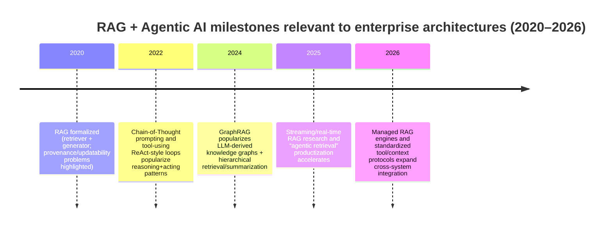
citeturn0search0turn13search0turn0search1turn0search2turn9search0turn13search3

## Enterprise reference model and decision axes

A practical enterprise reference model decomposes into two planes.

The data plane covers ingestion and indexing: document acquisition (connectors), parsing/OCR, chunking, embedding/vectorization, optional entity/relation extraction, and indexing into one or more retrieval stores (search index, vector DB, graph DB). These steps are what managed RAG offerings tend to “abstract,” while self-managed stacks expose them for custom control. citeturn3search3turn9search0turn1search1

The control plane covers orchestration and governance: agent loop (tool calling), query understanding (routing, decomposition), retrieval fusion/reranking, prompt assembly, generation with citation formatting, policy enforcement (RBAC/ABAC, DLP, safety filters), telemetry, and evaluation gates. Tool calling is the key interface boundary: modern agent frameworks and model APIs expose structured tool calls where the application executes tools and returns results. citeturn13search2turn10search3turn2search10

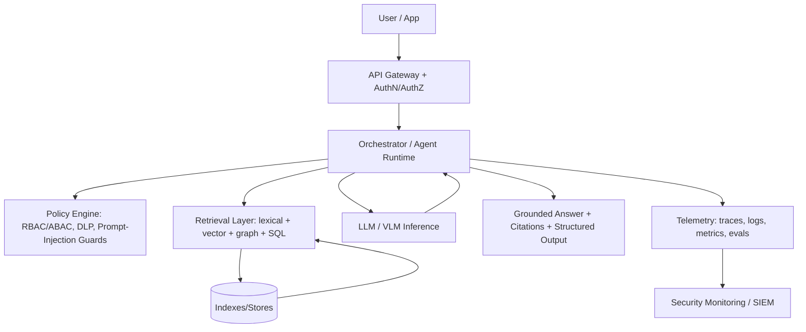
citeturn8search2turn12search0turn12search1

Decision axes that dominate enterprise outcomes:

Latency budget and interaction style: classic request/response chat; streaming responses; real-time updates from event streams. Streaming is widely supported at the API layer and can reduce perceived latency even when total compute stays similar. citeturn2search2turn2search10turn2search3

Retrieval substrate mix: lexical/hybrid search engines; specialized vector DBs; graph DBs (knowledge graphs); multi-store federation. Hybrid search is a first-class feature in major engines and a common baseline when terminology varies and exact matches matter. citeturn0search3turn1search2turn10search2

Orchestration topology: single-agent “retrieve then answer,” multi-agent/hierarchical orchestrator-with-subagents, and planner-executor separation. Multi-agent orchestration frameworks explicitly support hierarchical and multi-actor control flows. citeturn6search2turn6search18

Security and privacy posture: standard enterprise controls, DP for aggregate outputs, and TEEs/enclaves for protecting data-in-use from operators/cloud administrators. Confidential computing definitions and implementations are codified by major cloud vendors and hardware ecosystems. citeturn5search11turn11search0turn5search2turn11search2

Governance and auditability: mapping outputs to evidence; maintaining lineage of datasets/models/prompts; and aligning with broader AI risk management practices. NIST’s AI RMF frames risk management as an organizational discipline rather than a model feature. citeturn12search0turn12search8

## Comparative matrix of the twenty solution architectures

Heuristic scoring: 1–5 where 5 is strongest for that dimension (higher scalability, stronger security, lower latency, higher cost-efficiency, lower operational complexity, higher maturity). These are comparative judgments intended for CTO-level triage, not benchmarks.

| ID | Architecture (short name) | Scalability | Security | Latency | Cost-efficiency | Ops complexity | Maturity |
|---|---|---:|---:|---:|---:|---:|---:|
| A | Orchestrator-with-subagent Agentic RAG | 4 | 4 | 3 | 3 | 2 | 4 |
| B | Semantic Search RAG (dense + rerank / late-interaction) | 5 | 3 | 4 | 4 | 3 | 5 |
| C | Graph RAG (GraphRAG-style) | 4 | 4 | 2 | 3 | 2 | 4 |
| D | Hybrid RAG (vector + lexical + rules) | 5 | 4 | 4 | 4 | 3 | 5 |
| E | Multi-vector-store RAG (router + federation) | 5 | 4 | 3 | 3 | 2 | 4 |
| F | Streaming RAG (token streaming + retrieval streaming) | 4 | 3 | 5 | 3 | 3 | 3 |
| G | Real-time RAG (CDC + event streaming ingestion) | 5 | 4 | 4 | 3 | 2 | 4 |
| H | Multimodal RAG (text+image+layout) | 4 | 3 | 2 | 2 | 2 | 3 |
| I | Private LLM + RAG (on-prem/VPC) | 4 | 5 | 3 | 4 | 2 | 4 |
| J | Federated RAG (cross-cluster / cross-domain) | 5 | 4 | 3 | 3 | 2 | 4 |
| K | Knowledge-graph-first RAG (graph as system-of-record) | 4 | 4 | 3 | 3 | 2 | 4 |
| L | Tool-augmented RAG (tools + retrieval) | 4 | 4 | 3 | 3 | 2 | 4 |
| M | Chain-of-thought-safe RAG (reasoning isolation) | 4 | 5 | 3 | 3 | 3 | 3 |
| N | Planning-module Retrieval Agents (planner-executor) | 4 | 4 | 3 | 3 | 2 | 4 |
| O | Vector DB + Graph DB integrated retrieval | 4 | 4 | 3 | 3 | 2 | 4 |
| P | Differentially Private RAG | 3 | 5 | 2 | 2 | 2 | 2 |
| Q | Secure Enclave / Confidential Computing RAG | 3 | 5 | 2 | 2 | 1 | 3 |
| R | Enterprise MLOps-enabled RAG | 5 | 4 | 3 | 3 | 2 | 4 |
| S | Cloud-native Managed RAG (vendor KB/RAG engines) | 5 | 4 | 4 | 4 | 4 | 5 |
| T | Open-source End-to-end RAG stack | 5 | 3 | 3 | 5 | 2 | 4 |

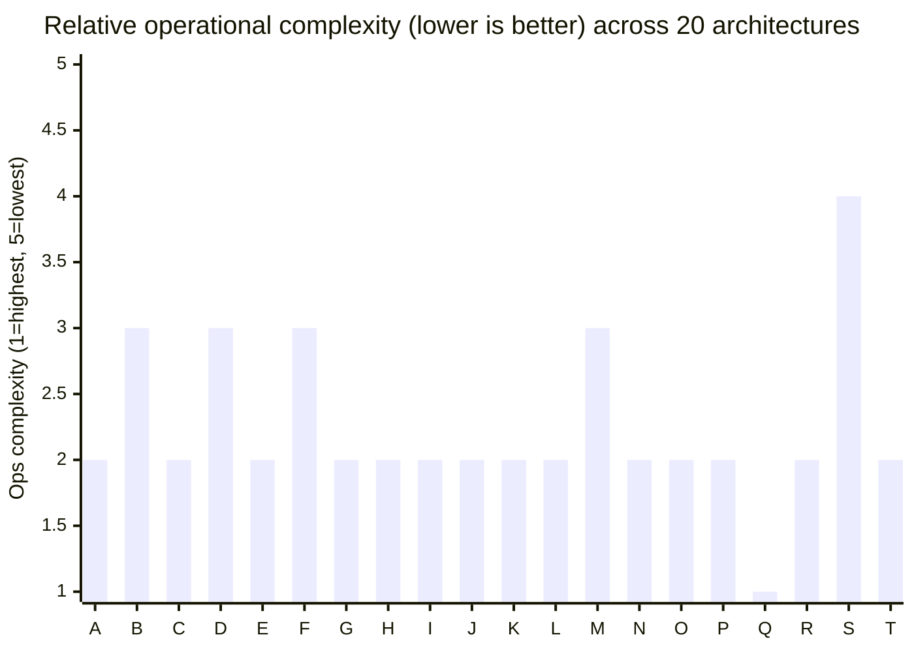

## Solution architectures catalog

**A — Orchestrator-with-subagent RAG (agentic AI)**

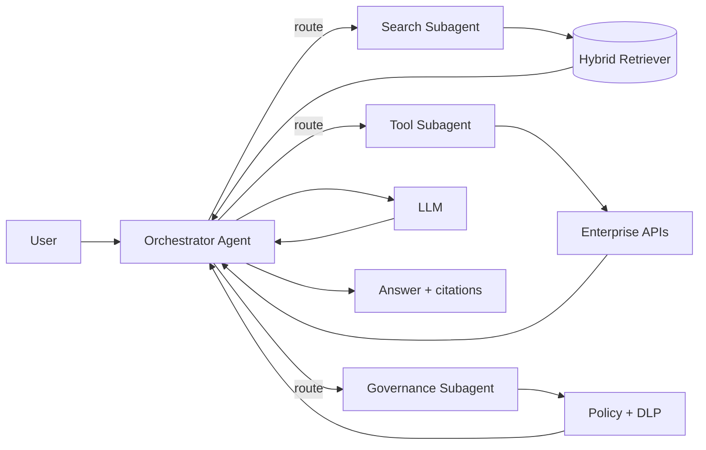

Technical description: a hierarchical controller delegates to specialized subagents (retrieval specialist, tool executor, governance gate) and merges outputs into a single grounded response. This operationalizes “reasoning + acting” loops where the model triggers retrieval and tools as needed. citeturn0search1turn6search2turn13search2  
Key components: agent runtime (state machine/graph); tool-calling LLM; retriever(s); policy/DLP checks; memory (conversation + working memory).  
Deployment patterns: cloud-agnostic Kubernetes microservices (orchestrator + retrieval + tool adapters); optional serverless tool adapters; service mesh for mTLS.  
Integration points: IdP (OIDC/OAuth); enterprise API gateway; corpus connectors; ticketing/ITSM; SIEM.  
Scalability: horizontally scale orchestrator workers; parallel subqueries/subagent execution; retrieval tier autoscaling.  
Latency: dominated by multi-step tool calls and multiple LLM turns; mitigate via parallelism and caching; stream partial output where possible. citeturn2search2turn6search2  
Cost drivers: multi-turn LLM calls; parallel subagent calls; reranking; tool/API invocation costs.  
Security/privacy: explicit governance subagent enforces policy before tool calls; mitigate prompt injection by isolating tools behind allowlists and schema validation.  
Data governance: strict source attribution and “no-evidence” refusals align with MISSA-style grounded behavior expectations. fileciteturn0file0  
Observability: end-to-end traces per request; tool-call spans; retrieval metrics; evaluation datasets and regression tests. citeturn8search2turn8search3  
Failure modes: tool loops/non-termination; inconsistent subagent outputs; partial outages in tool backends; prompt injection causing unsafe tool invocation.  
Operational complexity: high (coordination, state, retries, tool governance).  
Vendor/OSS options: LangGraph (agent graphs) citeturn6search2turn6search18; Semantic Kernel function-calling orchestration (planner deprecations noted) citeturn6search3; LangChain agents citeturn10search3; Claude tool use citeturn13search2; OpenAI Responses/streaming citeturn2search10turn13search1.  
CTO pros: strongest for complex workflows; clean separation of retrieval, tools, and policy; easier to insert human approval gates. CTO cons: cost and latency overhead of multi-step execution; higher testing burden; harder to guarantee determinism.  
Suitability score: **8.3/10** — enterprise assistants that must both answer and act (tickets, IAM tasks, ops runbooks, ERP/CRM workflows).

**B — Semantic search RAG (dense retrieval + reranking / late-interaction)**

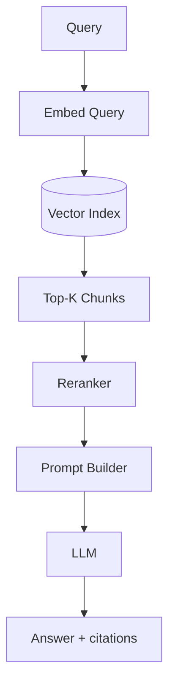

Technical description: classic RAG—vector retrieval provides candidate passages, optionally reranked via cross-encoders or late-interaction models for higher precision. The original RAG paper formalizes dense retrieval + generation as parametric + non-parametric memory. citeturn0search0  
Key components: embedding model; vector store; chunker; reranker (optional); citation formatter.  
Deployment patterns: vector DB as managed service or self-hosted; retrieval microservice behind an internal API; stateless LLM gateway.  
Integration points: content ingestion (CMS, fileshares, wikis); embedding pipelines; identity-aware metadata filters.  
Scalability: best-in-class for high QPS with sharded vector indexes; choose DBs designed for distributed scale or search engines with vector features. citeturn1search1turn10search2  
Latency: typically low when using approximate nearest neighbor plus lightweight reranking; late-interaction methods (multi-vector representations) trade memory for accuracy. citeturn1search0turn1search8  
Cost drivers: embedding generation (indexing); storage for vectors; GPU/CPU for rerankers; LLM tokens.  
Security/privacy: strongest when metadata filters enforce RBAC at retrieval time (document-level ACL alignment).  
Data governance: citations and passage provenance; retention/TTL policies per corpus.  
Observability: retrieval hit-rate; MRR/NDCG offline; “citation quality” metrics; trace retrieval spans. citeturn8search2turn8search3  
Failure modes: embedding drift; chunking errors; vector dimension mismatches; silent recall failures for exact terms.  
Operational complexity: medium (standard pipeline).  
Vendor/OSS options: Milvus citeturn1search1turn1search9; Qdrant citeturn10search1turn10search5; Weaviate citeturn1search2; OpenSearch vector search citeturn10search2turn10search6; ColBERT/late interaction citeturn1search0turn1search8.  
CTO pros: predictable; fast; easy to scale; broad vendor support. CTO cons: struggles with multi-hop/relational questions; vulnerable to prompt injection if retrieved text is treated as instructions.  
Suitability score: **8.7/10** — enterprise Q&A over documents, policies, knowledge bases, and support content.

**C — Graph RAG (GraphRAG-style hierarchical synthesis)**

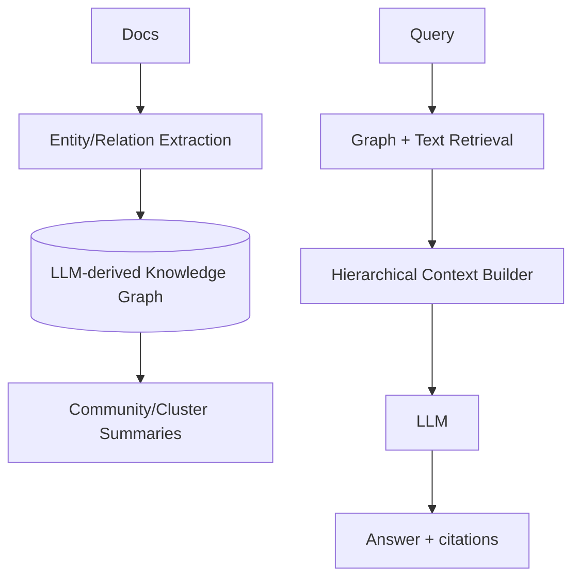

Technical description: constructs an LLM-derived knowledge graph from text, computes summaries over graph communities/clusters, and retrieves via graph structure plus text evidence to support corpus-level reasoning beyond snippet similarity. Microsoft positions GraphRAG as a structured, hierarchical alternative to “naive semantic-search snippets.” citeturn0search2turn0search10turn0search6  
Key components: extraction pipeline; graph store; community detection/summarization; graph-aware retriever; synthesizer.  
Deployment patterns: batch graph build (nightly or incremental); graph DB + object store for artifacts; query-time graph traversal service.  
Integration points: document ingestion; ontology/schema management; analytics engines for graph algorithms.  
Scalability: graph build can be batch-parallel; graph queries scale via graph DB clustering or partitioning; retrieval often heavier than pure vector.  
Latency: higher than classic RAG due to traversal + summarization; mitigate via precomputed summaries and caching.  
Cost drivers: extraction LLM calls; graph algorithms; storage of graph + summaries.  
Security/privacy: graph can amplify exposure by connecting entities across silos; enforce edge/node-level permissions.  
Data governance: explicit lineage from graph nodes/claims back to document spans; version KG builds as artifacts.  
Observability: graph build success rate; extraction precision; query-time traversal counts; summary staleness.  
Failure modes: hallucinated entities/edges; graph bloat; schema drift; over-summarization losing critical constraints.  
Operational complexity: high (pipeline + graph analytics).  
Vendor/OSS options: Microsoft GraphRAG repo/docs citeturn0search10turn0search2; Neo4j GraphRAG tooling citeturn6search0turn6search4; graph-vector hybrids (e.g., Qdrant+Neo4j examples) citeturn6search16.  
CTO pros: best for multi-hop reasoning, entity-centric exploration, “what connects X to Y,” and large-corpus synthesis. CTO cons: hard to validate extraction quality; heavier pipeline and governance; higher latency.  
Suitability score: **7.9/10** — investigative intelligence, compliance linkage analysis, scientific/technical corpora with dense relationships.

**D — Hybrid RAG (vector + symbolic/lexical + rules)**

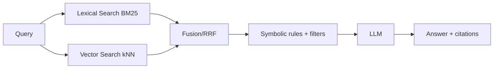

Technical description: hybrid retrieval combines lexical matching (high precision for identifiers/rare terms) with vector similarity (semantic recall), then fuses results and applies symbolic filters/rules (access control, business logic, schema constraints). Hybrid search is a first-class feature in major engines and is marketed explicitly for powering RAG/agents. citeturn0search3turn1search2turn9search0  
Key components: search engine with BM25 + kNN; fusion (RRF or weighted); filters; policy checks.  
Deployment patterns: single search backend (Elastic/OpenSearch/Weaviate) simplifies ops; or split lexical engine + vector DB with fusion at app layer.  
Integration points: data catalog for field semantics; synonym/terminology maps; ACL metadata propagation.  
Scalability: high when using search engines designed for distributed indexing and query fan-out. citeturn0search3turn10search2  
Latency: typically low-to-medium; fusion adds minor overhead; reranking is main variable.  
Cost drivers: reranking models; large-scale indexing; managed search cluster sizing.  
Security/privacy: inline filters support “least privilege” retrieval; avoid mixing tenants in fused ranking without strict segmentation.  
Data governance: dual evidence paths (lexical + semantic) improve auditability for “why retrieved.”  
Observability: separate metrics for lexical vs vector contributions; fusion effectiveness; zero-result rates per channel.  
Failure modes: fusion misweights leading to irrelevant context; keyword-only queries underperform if vectors dominate; inconsistent analyzers across languages.  
Operational complexity: medium.  
Vendor/OSS options: Elastic hybrid search citeturn0search3; Weaviate hybrid search citeturn1search2; Azure AI Search classic + agentic retrieval options citeturn9search0turn9search4; OpenSearch vector + lexical citeturn10search2turn10search6.  
CTO pros: best default for heterogeneous enterprise text; minimizes “semantic-only” blind spots. CTO cons: tuning burden; relevance evaluation required; risk of “double counting” noisy chunks.  
Suitability score: **9.0/10** — enterprise-wide search + chat over mixed-quality corpora (policies, tickets, wikis, contracts).

**E — Multi-vector-store RAG (routing + federation across multiple vector indexes)**

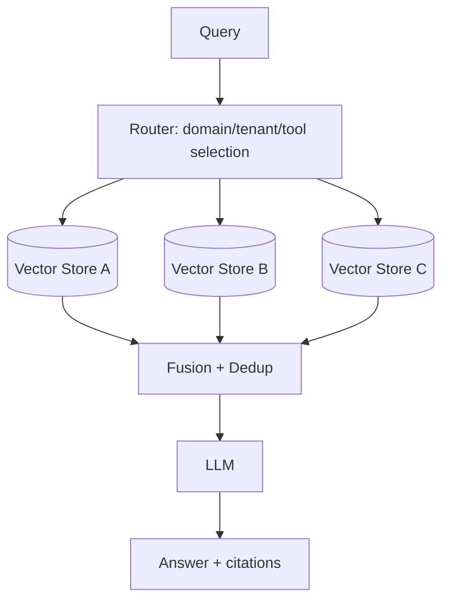

Technical description: maintains multiple vector stores (by tenant, domain, geography, regulatory boundary, or embedding type) and uses a router to choose one or many stores per query, then fuses results. Multi-tenancy and namespace isolation are common operational primitives in managed vector DBs. citeturn1search3turn7search0  
Key components: routing classifier/LLM; per-domain vector indexes; fusion/dedup; shared metadata and ACL layer.  
Deployment patterns: per-region indexes to satisfy data residency; per-business-unit indexes to preserve ownership; global router service.  
Integration points: enterprise taxonomy/ontology; data catalog for index discovery; key management per domain.  
Scalability: very high—horizontal growth by adding stores; scale query fan-out carefully.  
Latency: variable; multi-store fan-out increases tail latency; mitigate with per-store timeouts and “best-effort” partial results.  
Cost drivers: duplicated infrastructure; duplicated embeddings when same docs appear in multiple domains; cross-store reranking.  
Security/privacy: strong isolation when stores map to trust boundaries; reduces blast radius.  
Data governance: explicit ownership by domain; easier retention policies; harder global dedup/lineage.  
Observability: per-store QPS, recall, and tail latency; router misroute rate; cross-store duplication rate.  
Failure modes: router errors; inconsistent embedding models across stores; partial outages causing biased answers.  
Operational complexity: high (many stores, routing, lifecycle).  
Vendor/OSS options: Pinecone multi-tenancy patterns (indexes/namespaces/metadata) citeturn1search3; Vespa multi-schema + query federation patterns citeturn7search0turn7search8; OpenSearch/Elastic CCS for cross-cluster search in hybrid deployments citeturn7search1turn7search2.  
CTO pros: matches real enterprise boundaries; supports sovereignty and segmented operations. CTO cons: fragmented relevance tuning; higher ops load; more difficult global governance.  
Suitability score: **8.1/10** — conglomerates, regulated enterprises, multinational data residency constraints, multi-tenant SaaS.

**F — Streaming RAG (streaming generation + progressive retrieval)**

```mermaid
flowchart LR
  Q[Query] --> RET[Fast retrieval]
  RET --> CTX[Initial context]
  CTX --> LLM[LLM (stream output)]
  LLM -->|tokens| UI[Client stream]
  LLM -->|needs more| RET2[Follow-up retrieval]
  RET2 --> LLM
```

Technical description: streams partial answers immediately while retrieval and generation continue; may interleave additional retrieval mid-generation for long contexts or evolving user input. Streaming is explicitly supported using server-sent events in major LLM APIs. citeturn2search2turn2search10 Research systems like StreamingRAG target streaming data contexts and “real-time contextual retrieval.” citeturn2search0turn2search12  
Key components: streaming-capable LLM client; retrieval cache; incremental prompt builder; UI transport (SSE/WebSocket).  
Deployment patterns: gateway that supports streaming responses end-to-end; backpressure control; circuit breakers for retrieval refresh.  
Integration points: UI frameworks; API gateways that preserve streaming; observability correlation IDs across streamed chunks.  
Scalability: good; must manage long-lived connections and concurrency.  
Latency: excellent perceived latency; total latency unchanged.  
Cost drivers: longer average sessions; partial generations discarded; repeated retrieval calls.  
Security/privacy: careful redaction before emitting tokens; avoid streaming sensitive snippets before policy checks finish.  
Data governance: token-by-token citations are hard; use staged output: draft → finalize with citations.  
Observability: stream lifecycle metrics; “time-to-first-token”; mid-stream tool call frequency. citeturn2search10turn8search2  
Failure modes: mid-stream tool failure; partial answers without final citations; client disconnects leaving orphan compute.  
Operational complexity: medium.  
Vendor/OSS options: OpenAI streaming responses citeturn2search2turn2search10; LlamaIndex streaming query engine citeturn2search3; streaming RAG research (StreamingRAG) citeturn2search0.  
CTO pros: materially better UX for long answers; good fit for chat UIs. CTO cons: governance/citations are harder; increases complexity of retries and consistency.  
Suitability score: **7.8/10** — customer-facing assistants, developer copilots, any UX sensitive to time-to-first-token.

**G — Real-time RAG (CDC + event streaming ingestion + fast reindex)**

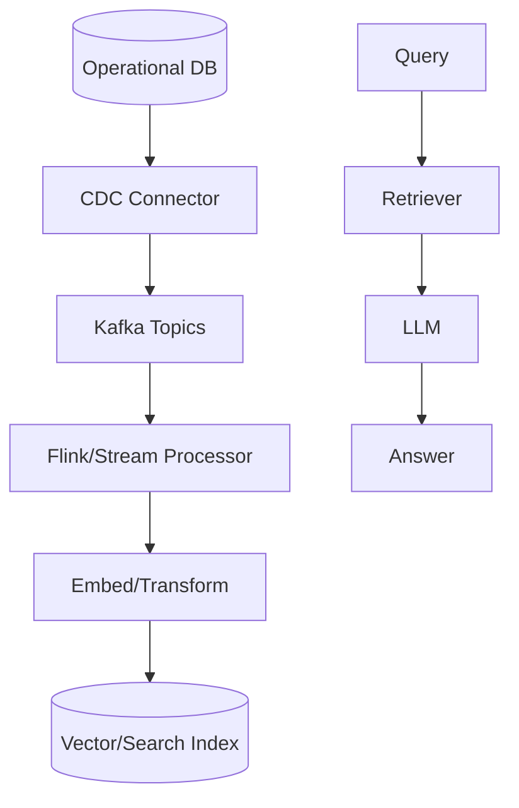

Technical description: uses change data capture (CDC) to propagate updates from operational systems into retrieval indexes, enabling near-real-time grounding on the latest state. Debezium describes capturing change events into Kafka and then using sink connectors to stream into downstream systems. citeturn14search0 Kafka provides durable pub/sub streams and processing of records as they occur, and Kafka Connect standardizes connector-based movement between Kafka and external systems. citeturn14search1turn14search7 Flink provides stateful stream processing with checkpoint-based fault tolerance. citeturn14search2turn14search6  
Key components: CDC connectors; event bus; stream processor; embedding service; index upserter; idempotent writes.  
Deployment patterns: active-active ingestion per region; exactly-once/at-least-once tradeoffs; backfill pipeline for reindexing.  
Integration points: schema registry; data quality checks; feature store/catalog if embeddings reused.  
Scalability: very high (streaming platforms scale horizontally).  
Latency: sub-minute to seconds depending on embedding throughput and indexing.  
Cost drivers: continuous embedding; stream infra; always-on processors; hot index refresh costs.  
Security/privacy: enforce row/field-level controls before indexing; protect event streams (mTLS, ACLs).  
Data governance: event lineage is strong; treat indexes as derived data products with versioned schemas.  
Observability: lag metrics (CDC → index); dead-letter queues; reprocessing counts; “staleness” SLOs.  
Failure modes: schema drift breaks processors; out-of-order events; poisoning from bad upstream data; embedding backlogs.  
Operational complexity: high (streaming ops + ML ops).  
Vendor/OSS options: Debezium citeturn14search0; Apache Kafka citeturn14search1turn14search9; Apache Flink citeturn14search2turn14search14; sinks to OpenSearch/Elastic/vector DBs (vendor-specific).  
CTO pros: answers reflect current operational truth; enables “ask about live business state.” CTO cons: expensive; streaming reliability engineering required; misindexing can quickly propagate errors.  
Suitability score: **8.0/10** — support over live tickets/incidents, inventory/order status assistants, security operations, real-time policy changes.

**H — Multimodal RAG (documents with images/layout + multimodal embeddings)**

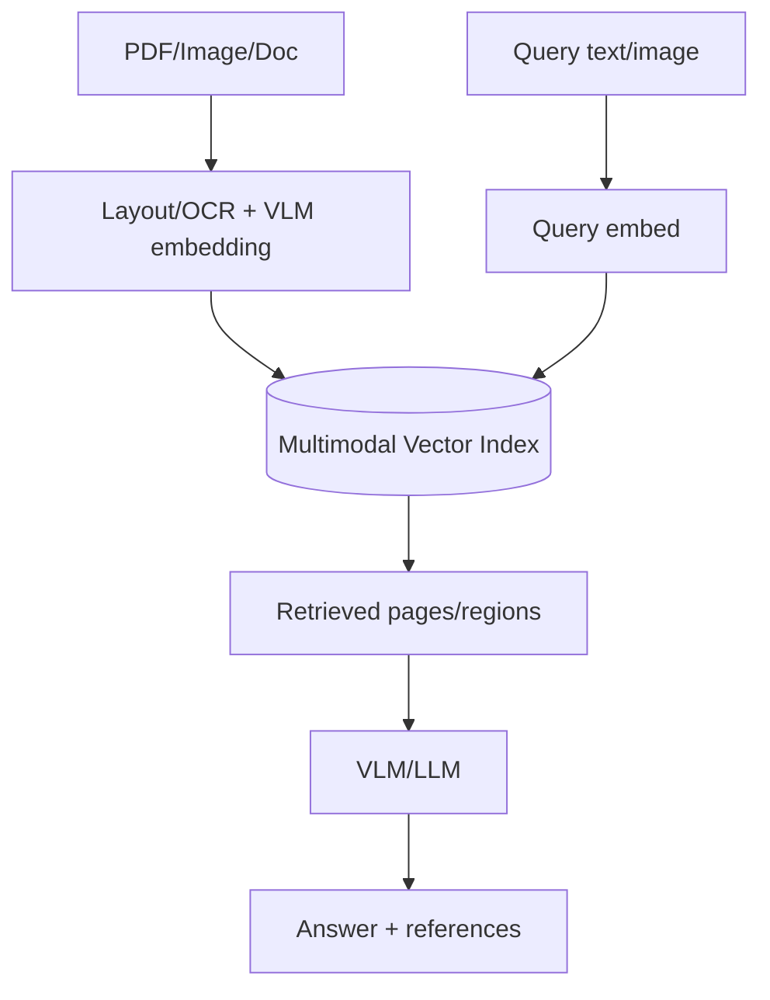

Technical description: retrieval operates over multimodal representations (text + images + layout). CLIP-style contrastive image-text representation learning underpins many text-image retrieval approaches. citeturn3search0turn3search12 Recent multimodal RAG pipelines (e.g., VisRAG) embed documents as images using a vision-language model to retain layout/visual information that text-only parsing loses. citeturn3search2  
Key components: OCR/layout parser; multimodal embedder; vector store; VLM for answer synthesis.  
Deployment patterns: GPU-accelerated ingestion; tiered storage for original binaries; caching of page-level embeddings.  
Integration points: document management systems; eDiscovery; image redaction pipelines.  
Scalability: moderate—GPU ingestion can bottleneck; retrieval scale similar to vector search.  
Latency: higher than text-only due to larger embeddings and heavier models.  
Cost drivers: GPU-heavy ingestion; larger storage footprint; VLM inference.  
Security/privacy: images often contain PII (signatures, IDs); redaction and DLP must occur pre-index.  
Data governance: retain linkage from retrieved region/page to original file and access controls.  
Observability: OCR quality metrics; retrieval accuracy by document type; VLM hallucination rate.  
Failure modes: OCR errors; layout misinterpretation; retrieval mismatch across modalities; privacy leakage from unredacted visuals.  
Operational complexity: high.  
Vendor/OSS options: CLIP citeturn3search0turn3search4; BLIP-2 family for bridging vision-language with frozen encoders/LLMs citeturn3search1turn3search5; VisRAG research citeturn3search2; managed document extraction pipelines (provider-specific).  
CTO pros: unlocks value in scanned PDFs, forms, manuals, diagrams. CTO cons: expensive and complex; governance is harder; evaluation datasets are harder to curate.  
Suitability score: **7.1/10** — insurance/claims, supply chain docs, engineering manuals, compliance PDFs, diagram-heavy domains.

**I — Private LLM + RAG (self-hosted inference in VPC/on-prem)**

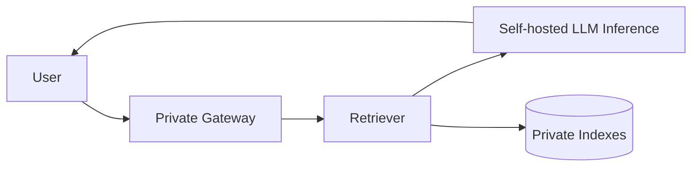

Technical description: keeps inference and retrieval inside controlled infrastructure (on-prem or private cloud), reducing exposure of prompts/context to external providers. High-throughput open-source inference servers (e.g., vLLM) and Kubernetes-native serving platforms (e.g., KServe) are standard building blocks for this pattern. citeturn4search0turn4search1  
Key components: self-hosted model runtime; GPU scheduler; secrets/KMS; private indexes; model registry and CI/CD.  
Deployment patterns: air-gapped or restricted VPC; Kubernetes with node pools for GPUs; canary rollouts for model versions.  
Integration points: enterprise IAM; HSM/KMS; internal data sources; SIEM.  
Scalability: moderate-to-high depending on GPU fleet and batching; vLLM emphasizes continuous batching and memory efficiency (PagedAttention) to improve throughput. citeturn4search0  
Latency: good with proper batching and cache; tail latency sensitive to GPU saturation.  
Cost drivers: GPU capex/opex; serving overhead; on-prem ops staffing.  
Security/privacy: strongest control plane; still must mitigate insider risks; ensure encryption at rest/in transit.  
Data governance: easiest to ensure residency and retention; hardest to “inherit” managed-provider governance automation.  
Observability: GPU utilization; token throughput; queue depth; retrieval metrics; model drift stats.  
Failure modes: GPU capacity crunch; model load failures; driver/runtime incompatibilities; poor batching causing latency collapse.  
Operational complexity: high.  
Vendor/OSS options: vLLM citeturn4search0turn4search4; KServe (Kubernetes inference platform) citeturn4search1turn4search5; open models with explicit licensing (e.g., Llama licenses) citeturn4search2; private vector/search stores (Milvus/OpenSearch/Qdrant). citeturn1search1turn10search2turn10search1  
CTO pros: maximum control; aligns with sovereignty/regulatory constraints. CTO cons: GPU supply chain and ops burden; slower feature velocity vs managed AI platforms.  
Suitability score: **8.4/10** — regulated industries, “no external prompt sharing,” sovereign AI, high-volume internal assistants.

**J — Federated RAG (cross-cluster / cross-domain retrieval without centralizing all data)**

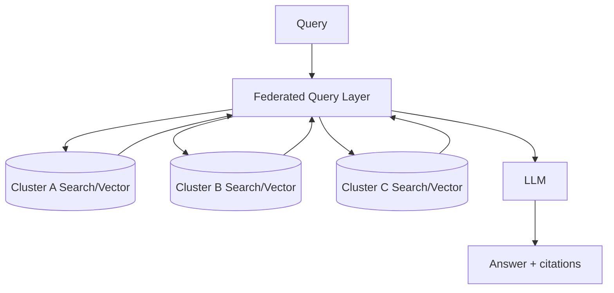

Technical description: executes a single search/query across multiple remote clusters or domains, then aggregates results for grounding. Cross-cluster search is explicitly supported in Elastic and OpenSearch. citeturn7search1turn7search2  
Key components: federated query broker; per-cluster auth; result normalization; deduplication; ranking fusion.  
Deployment patterns: hub-and-spoke federation; regional clusters with skip/unavailable policies; fallbacks when a domain is unreachable. citeturn7search1  
Integration points: IAM federation; cross-domain audit trails; data catalogs for cluster discovery.  
Scalability: high; scales by adding clusters; network fan-out is the constraint.  
Latency: medium (remote calls).  
Cost drivers: multiple clusters; cross-domain bandwidth; duplicated indexing.  
Security/privacy: strong if each domain enforces local permissions and returns only authorized hits; federation layer must not bypass controls.  
Data governance: supports “data stays where it lives”; complicates global retention and dedup.  
Observability: per-cluster availability; fan-out success rate; partial-result frequency; cross-domain latency heatmaps.  
Failure modes: split brain permissions; inconsistent analyzers; remote cluster outages; ranking skew by cluster size.  
Operational complexity: high.  
Vendor/OSS options: Elastic cross-cluster search citeturn7search1; OpenSearch cross-cluster search citeturn7search2turn7search6; Vespa query federation patterns via multi-schema approaches citeturn7search0turn7search8.  
CTO pros: aligns with organizational autonomy; avoids central data lake for all content. CTO cons: higher tail latency; distributed governance consistency is hard.  
Suitability score: **7.7/10** — large enterprises with multiple search domains, M&A environments, regulated separation of business units.

**K — Knowledge-graph-first RAG (graph as primary retrieval system-of-record)**

```mermaid
flowchart TB
  D[Structured + Extracted Facts] --> KG[(Knowledge Graph)]
  Q[Query] --> GQ[Graph Query/Traversal]
  GQ --> EV[Evidence Expansion (docs/snippets)]
  EV --> LLM[LLM] --> A[Answer + citations]
```

Technical description: treats the knowledge graph as the primary semantic layer and uses retrieval from text as evidence expansion when needed. Neo4j’s GraphRAG tooling emphasizes graph population and retrieval options (vector/hybrid/natural language to Cypher) as core capabilities. citeturn6search0turn6search12  
Key components: ontology; entity resolution; graph query engine; evidence backpointers to documents.  
Deployment patterns: graph DB cluster; batch + incremental updates; read replicas for query-heavy workloads.  
Integration points: master data management; reference data; schema registries; lineage systems.  
Scalability: moderate; depends on graph DB partitioning and query patterns.  
Latency: moderate; can be low for constrained traversals.  
Cost drivers: ETL/entity resolution; graph storage; specialized graph expertise.  
Security/privacy: fine-grained auth can be complex (node/edge-level); graph may join sensitive entities across systems—explicit controls needed.  
Data governance: strong explainability when answers are derived from explicit relationships; requires disciplined ontology management.  
Observability: graph query performance; drift in entity resolution; stale edges.  
Failure modes: incorrect entity merges; ontology brittleness; overfitting to schema; missing connections cause false negatives.  
Operational complexity: high.  
Vendor/OSS options: Neo4j GraphRAG package/docs citeturn6search0turn6search4; Neptune vector indexing inside graph analytics contexts citeturn6search1.  
CTO pros: best for relationship-centric domains; explainable multi-hop reasoning. CTO cons: high upfront modeling cost; hard to keep graph current without strong data engineering.  
Suitability score: **7.8/10** — supply chain, fraud rings, IAM/entitlements graphs, regulatory entity relationships.

**L — Tool-augmented RAG (retrieval + external tools/APIs in the same loop)**

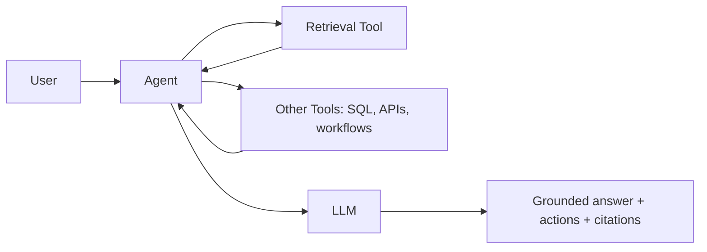

Technical description: extends “retrieve then answer” into “retrieve + act,” where tools can include search, SQL, ticketing, policy checkers, or calculators. ReAct formalizes interleaving reasoning traces and actions (including calling external knowledge sources) to reduce hallucination and improve interpretability. citeturn0search1turn0search5 Tool calling is a first-class interface in modern APIs (e.g., Claude tool use). citeturn13search2  
Key components: tool schemas; tool execution sandbox; retrieval; orchestrator; tool result normalizer.  
Deployment patterns: tool execution isolated in microservices or sandboxes; allowlist tools per role; break-glass approvals.  
Integration points: enterprise API management; data warehouses; CMDB; ITSM.  
Scalability: moderate; tool backends often become bottlenecks.  
Latency: medium; depends on external tool SLAs.  
Cost drivers: tool usage (warehouse queries, API calls); multiple LLM turns.  
Security/privacy: tool injection is the main risk; enforce JSON schema, tool allowlists, and policy gates before execution.  
Data governance: log tool calls and inputs/outputs for audit; tie tool outputs to final citations where applicable.  
Observability: per-tool error rates; tool latency; “tool overuse” detection; trace spans. citeturn8search2turn8search3  
Failure modes: tool misexecution; stale tool results; non-idempotent tool actions; cascading failures from external outages.  
Operational complexity: high.  
Vendor/OSS options: LangChain RAG agents citeturn10search3; Claude tool use citeturn13search2; OpenAI Responses with tools/streaming citeturn2search10turn13search1; MCP as tool/context integration protocol citeturn13search3turn13search11.  
CTO pros: converts assistants into workflow engines; supports “answer + do.” CTO cons: materially higher security and testing surface; outages propagate to user experience.  
Suitability score: **8.2/10** — IT operations copilots, reporting agents (SQL), enterprise automation under strong governance.

**M — Chain-of-thought-safe RAG (reasoning isolation + auditable but non-exfiltrating traces)**

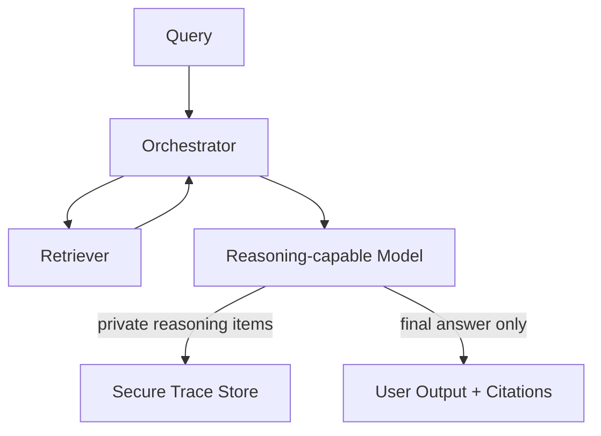

Technical description: separates internal reasoning artifacts from user-visible output, retaining auditable traces in restricted logs while returning only grounded answers and citations. Chain-of-thought prompting improves reasoning performance but also creates sensitive intermediate content that enterprises may need to treat as protected telemetry rather than user output. citeturn13search0 Modern reasoning-model APIs explicitly discuss “reasoning items” and managing reasoning state across tool calls, enabling architectural separation of reasoning artifacts from final responses. citeturn13search1  
Key components: reasoning-capable model client; secure log store with access controls; redaction layer; policy engine.  
Deployment patterns: dual-channel output pipeline (private trace vs public answer); restricted trace retention policies.  
Integration points: SIEM; audit systems; privacy office workflows; incident response.  
Scalability: similar to whichever retrieval/orchestration is used.  
Latency: moderate; extra checks/logging.  
Cost drivers: additional tokens for reasoning; secure storage of traces; monitoring/alerting.  
Security/privacy: reduces risk of leaking hidden prompts, policies, or sensitive reasoning; still requires prompt injection defenses in retrieval.  
Data governance: treat traces as regulated data; apply retention, legal hold, access review.  
Observability: strong—private traces enable debugging; must control who can access them.  
Failure modes: trace store outage blocks service if not designed with degrade modes; incomplete trace correlation; redaction bugs.  
Operational complexity: medium-to-high (governance + logging).  
Vendor/OSS options: OpenAI reasoning models guidance citeturn13search1turn13search5; OpenTelemetry for trace transport citeturn8search2; Phoenix for LLM tracing/evals citeturn8search3turn8search11.  
CTO pros: safer operational posture; better debugging without exposing internals. CTO cons: governance overhead; careful access control required; unclear cross-vendor standardization of reasoning artifacts.  
Suitability score: **7.6/10** — regulated assistants where internal reasoning may contain sensitive data or policy logic.

**N — Retrieval-augmented agents with planning modules (planner–executor separation)**

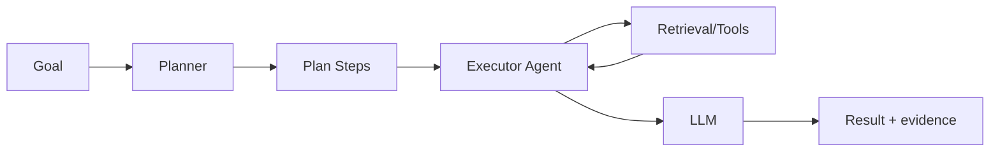

Technical description: a planning component decomposes goals into steps; an executor handles retrieval/tool calls. Some frameworks have deprecated older planning approaches in favor of function-calling loops, indicating ongoing evolution of “planner” implementations in production SDKs. citeturn6search3  
Key components: planner (LLM or symbolic); step runtime; tool registry; state store; retry/rollback logic.  
Deployment patterns: durable workflow engines for long-running plans; human approvals at key steps; idempotent tool design.  
Integration points: workflow orchestration (Airflow/Temporal/etc.); ticketing approvals; policy-as-code.  
Scalability: good for asynchronous/queued execution; avoid synchronous chains for user-facing latency constraints.  
Latency: moderate to high for complex plans; suitable for background tasks.  
Cost drivers: multiple LLM calls; long-running workflows; tool calls.  
Security/privacy: plan injection risks; enforce constraints on allowable steps and tool usage.  
Data governance: each step logs evidence gathered; final result includes citations and action audit.  
Observability: step-level tracing; plan success rate; tool failure heatmaps. citeturn8search2  
Failure modes: brittle plans; partial execution leaving side effects; infinite loops.  
Operational complexity: high.  
Vendor/OSS options: Semantic Kernel planning guidance (function-calling recommended; older planners removed) citeturn6search3; LangGraph durable multi-step flows citeturn6search2turn6search18; Azure AI Search “agentic retrieval” concept for query decomposition parallels planner behavior for retrieval. citeturn9search0turn9search4  
CTO pros: robust for multi-step enterprise tasks; clean audit per step. CTO cons: expensive; difficult to test; requires workflow discipline.  
Suitability score: **7.9/10** — back-office automation, research agents, multi-step compliance checks.

**O — Vector DB + Graph DB integrations (dual-store retrieval with cross-links)**

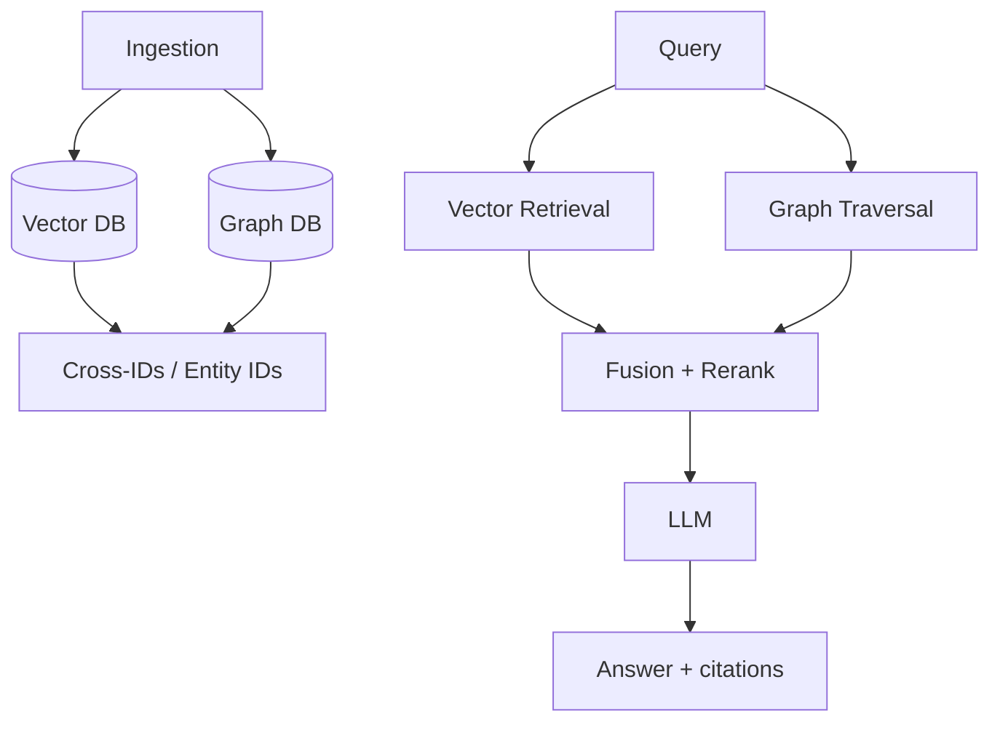

Technical description: stores embeddings for similarity search in a vector DB and explicit relationships/entities in a graph DB, then fuses candidates. Graph vendors increasingly document hybrid patterns—e.g., Qdrant + Neo4j GraphRAG examples—and cloud graph analytics offerings support vector indexing inside graph contexts. citeturn6search16turn6search1  
Key components: identity resolution layer; shared entity IDs between stores; fusion/reranker; lineage mapping to source docs.  
Deployment patterns: side-by-side clusters; event-driven sync of entity IDs; periodic reconciliation jobs.  
Integration points: MDM systems; CRM/ERP identifiers; knowledge graph pipelines.  
Scalability: moderate; hardest part is consistent cross-store synchronization.  
Latency: moderate; parallel queries help.  
Cost drivers: two storage systems; synchronization processes; reranking.  
Security/privacy: must enforce consistent ACLs in both stores; avoid leaking graph relationships that user lacks permission to know exist.  
Data governance: dual lineage: “why retrieved” includes semantic similarity and relationship paths.  
Observability: cross-store consistency metrics; sync lag; mismatch counters.  
Failure modes: ID drift; partial updates; inconsistent permissions; fusion errors.  
Operational complexity: high.  
Vendor/OSS options: Neo4j GraphRAG tooling citeturn6search0turn6search4; Qdrant + Neo4j GraphRAG example citeturn6search16; Neptune Analytics vector index citeturn6search1.  
CTO pros: best of both worlds (semantic + relational); strong for entity-centric retrieval. CTO cons: complex sync and governance; cost of two systems.  
Suitability score: **7.8/10** — customer 360, fraud/AML, supply chain investigations, asset/CMDB intelligence.

**P — RAG with differential privacy (DP-aware retrieval/aggregation)**

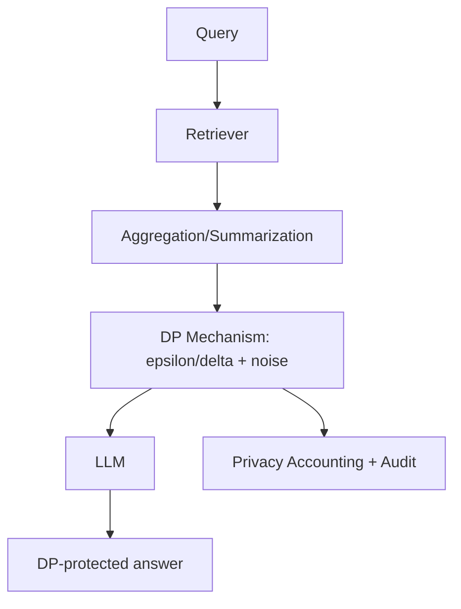

Technical description: applies differential privacy mechanisms to outputs that aggregate across sensitive datasets, providing quantified privacy loss bounds (ε, δ). NIST has published guidance on evaluating differential privacy guarantees, framing DP as a mathematical framework that quantifies privacy risk when an individual’s data appears in a dataset. citeturn5search0turn5search4 OpenDP provides vetted DP algorithms and tooling to build privacy-preserving computations. citeturn5search1turn5search5  
Key components: DP accounting; sensitivity analysis; DP mechanisms; governance controls on allowable query classes.  
Deployment patterns: DP “answering service” as a separate tier; strict rate limiting and privacy budget management per user/tenant.  
Integration points: privacy office policy; consent management; data classification systems.  
Scalability: moderate; DP accounting and constraints limit query classes.  
Latency: higher due to aggregation + DP computation + audits.  
Cost drivers: DP engineering; constrained outputs may require more iteration.  
Security/privacy: strong privacy guarantees when correctly implemented; primary risk is mis-specified sensitivity or misuse outside DP threat model.  
Data governance: privacy budgets become governance objects; enforce retention and audit.  
Observability: privacy budget consumption; DP parameter usage; denied query rates.  
Failure modes: incorrect accounting; privacy budget exhaustion; user dissatisfaction due to noisy answers.  
Operational complexity: very high (specialized expertise).  
Vendor/OSS options: NIST DP guidance citeturn5search0; OpenDP library/docs citeturn5search5turn5search1.  
CTO pros: uniquely valuable for privacy-critical analytics assistants. CTO cons: constrained applicability; hard to explain to stakeholders; correctness burden is extreme.  
Suitability score: **6.2/10** — privacy-preserving analytics summaries (healthcare/public sector), aggregate insights where DP is a requirement.

**Q — RAG with secure enclaves / confidential computing (data-in-use protection)**

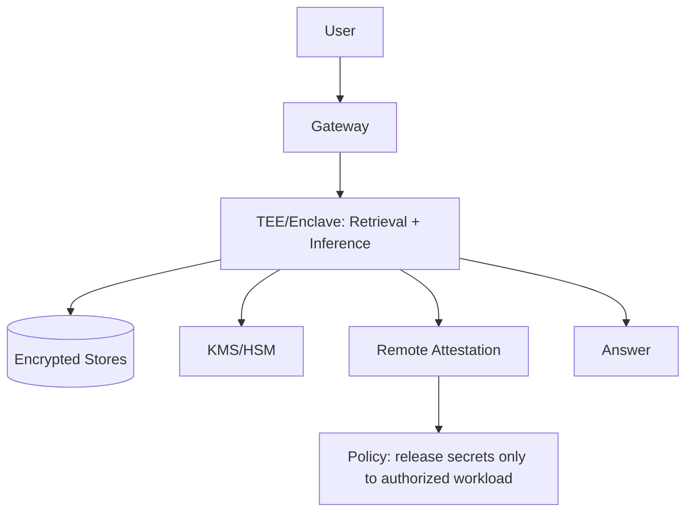

Technical description: runs sensitive retrieval and/or inference inside a hardware-based Trusted Execution Environment (TEE), using attestation to prove workload integrity before releasing secrets. AWS Nitro Enclaves are designed to reduce attack surface for sensitive processing via isolated environments. citeturn5search2 Google Confidential Space is explicitly described as a TEE that releases secrets only to authorized workloads via attestation and hardened images. citeturn11search0turn11search12 Microsoft defines confidential computing around protecting data-in-use in a hardware-based attested TEE. citeturn5search11turn5search3  
Key components: enclave runtime; attestation verifier; enclave-aware key release; enclave networking (vsock/proxies).  
Deployment patterns: enclave-per-request is rare; typical is enclave as a service with strict API; integrate with KMS for key release.  
Integration points: key management; policy engines; regulated data pipelines.  
Scalability: limited by enclave/TEE constraints and hardware availability; GPU TEEs are emerging but add complexity. citeturn11search3turn11search7  
Latency: higher; enclave transitions and crypto overhead.  
Cost drivers: specialized instances/hardware; attestation infra; engineering complexity.  
Security/privacy: strongest for protecting data from infrastructure operators; does not eliminate application-layer risks like prompt injection.  
Data governance: attestation logs become audit artifacts; secrets release policies are governance-critical.  
Observability: constrained—debugging in enclaves is harder; rely on carefully designed telemetry.  
Failure modes: attestation failures; enclave image drift; key release outages; limited introspection causes long MTTR.  
Operational complexity: extreme.  
Vendor/OSS options: AWS Nitro Enclaves citeturn5search2; Google Confidential Space citeturn11search0turn11search12; Azure confidential computing/TEEs citeturn5search3turn5search11; AMD SEV for encrypted VMs citeturn11search2turn11search14.  
CTO pros: enables high-sensitivity workloads in shared infrastructure; reduces insider/operator risk. CTO cons: high cost; hard debugging; limited ecosystem maturity for full RAG + GPU inference.  
Suitability score: **7.0/10** — highly sensitive prompts/data (financial secrets, PHI, sovereign workloads) where data-in-use protection is mandated.

**R — Enterprise MLOps-enabled RAG (CI/CD, evaluation gates, telemetry, lineage)**

```mermaid
flowchart TB
  DATA[Data + Docs] --> PIPE[Ingestion/Embedding Pipeline]
  PIPE --> REG[Artifact/Model/Prompt Registry]
  REG --> DEP[Deployment: canary/A-B]
  DEP --> APP[RAG Service]
  APP --> OBS[OTel Traces + Metrics + Evals]
  OBS --> GATE[Quality/Safety Gates]
  GATE --> REG
```

Technical description: packages RAG as a continuously evaluated software+data product with reproducible pipelines, registries, staged deployments, and observability. MLflow provides experiment tracking and a model registry with lineage/versioning/metadata for lifecycle management. citeturn8search0turn8search8 Kubeflow Pipelines orchestrates ML workflows on Kubernetes. citeturn8search9turn8search5 OpenTelemetry standardizes traces/metrics/logs collection for distributed systems, and LLM observability tools frequently build on it. citeturn8search2turn8search3  
Key components: pipeline orchestrator; artifact registry; evaluation harness (retrieval + answer); prompt/version control; telemetry.  
Deployment patterns: GitOps; environment promotion; canary + rollback; “golden dataset” regression tests.  
Integration points: data catalogs; issue tracking; security reviews; compliance evidence stores.  
Scalability: high; this is process architecture more than retrieval substrate.  
Latency: minimal impact if evaluation is mostly offline; online guardrails can add overhead.  
Cost drivers: evaluation compute; tooling/licensing; engineering time.  
Security/privacy: improves auditability and change control; ensure test datasets are non-sensitive or properly handled.  
Data governance: version everything—corpora snapshots, embeddings, prompts, policies.  
Observability: end-to-end plus model/retrieval quality indicators; open-source phoenix explicitly supports OpenTelemetry-based tracing and evals. citeturn8search3turn8search11  
Failure modes: “silent regressions” if gates are weak; pipeline drift; poor dataset representativeness.  
Operational complexity: high, but reduces long-term risk.  
Vendor/OSS options: MLflow citeturn8search0turn8search8; Kubeflow Pipelines citeturn8search9turn8search5; OpenTelemetry citeturn8search2; Phoenix citeturn8search3.  
CTO pros: turns RAG into a governed product with measurable quality; reduces production surprises. CTO cons: upfront platform investment; requires disciplined engineering culture.  
Suitability score: **8.6/10** — any enterprise RAG beyond prototype, especially regulated environments and high-stakes workflows.

**S — Cloud-native managed RAG (managed knowledge bases / RAG engines / “agentic retrieval”)**

```mermaid
flowchart LR
  DS[Data Sources] --> MNG[Managed Ingest + Chunk + Embed]
  MNG --> KB[(Managed Knowledge Base / Index)]
  Q[Query] --> API[Managed RAG API]
  API --> KB
  API --> LLM[Hosted LLM]
  LLM --> OUT[Answer + citations]
```

Technical description: offloads ingestion/indexing/retrieval orchestration to cloud-managed services, often with built-in citations and governance hooks. Amazon Bedrock Knowledge Bases are explicitly positioned as an out-of-the-box RAG workflow that abstracts heavy lifting for ingestion and retrieval. citeturn3search3 Azure AI Search provides a RAG overview and distinguishes classic RAG from “agentic retrieval,” a pipeline that uses LLMs to decompose complex queries into subqueries and return structured responses for chat/agent consumption. citeturn9search0turn9search4 Google documents Vertex AI RAG Engine integrations, including using Vertex AI Search as a retrieval backend. citeturn9search1turn9search5  
Key components: managed connectors/indexers; managed vectorization; hosted inference; policy integration with cloud IAM.  
Deployment patterns: cloud-native; private networking options vary; multi-region DR via provider patterns.  
Integration points: cloud IAM; secrets managers; cloud logging/monitoring; enterprise IdP via federation.  
Scalability: excellent; autoscaling is managed.  
Latency: generally good; varies by region and service tier.  
Cost drivers: per-request pricing; managed indexing/storage; cross-region data transfer.  
Security/privacy: benefits from provider security controls; ensure contractual/data handling alignment; enforce private connectivity where needed.  
Data governance: built-in citations and ingestion pipelines help; lineage into enterprise catalogs may require extra work.  
Observability: integrates with cloud-native telemetry; may limit low-level introspection.  
Failure modes: provider outages; service limits; vendor lock-in; limited customization for specialized retrieval.  
Operational complexity: lowest among production-ready options.  
Vendor/OSS options: Amazon Bedrock Knowledge Bases citeturn3search3; Azure AI Search RAG + agentic retrieval citeturn9search0turn9search4; Vertex AI RAG Engine + Search backend citeturn9search1turn9search5; Databricks Mosaic AI Agent Framework positioned for measured/safe/governed RAG apps. citeturn9search2turn9search6  
CTO pros: fastest path to production; managed scaling and ingestion; lower ops burden. CTO cons: lock-in; less control over retrieval internals; governance integration may be opaque.  
Suitability score: **9.1/10** — standard enterprise RAG where speed-to-production and reduced ops dominate.

**T — Open-source end-to-end RAG stacks (self-assembled but coherent OSS pipeline)**

```mermaid
flowchart TB
  SRC[Sources] --> ING[OSS Ingestion/Chunking]
  ING --> EMB[OSS Embeddings]
  EMB --> VDB[(OSS Vector DB/Search)]
  Q[Query] --> RET[Retriever]
  RET --> ORCH[OSS Orchestrator]
  ORCH --> LLM[Self-hosted or API LLM]
  LLM --> OUT[Answer + citations]
  ORCH --> OBS[OTel + OSS LLM Observability]
```

Technical description: composes an end-to-end RAG system entirely from open-source components, giving maximum control and cost efficiency at the expense of integration work. Haystack provides explicit tutorials on building retrieval-augmented QA pipelines. citeturn10search0turn10search8 LangChain documents building a “RAG agent” that executes searches via tools. citeturn10search3 Common OSS vector/search substrates include Milvus, Qdrant, and OpenSearch. citeturn1search1turn10search1turn10search2  
Key components: orchestration framework; vector/search backend; ingestion pipeline; optional self-hosted inference (vLLM/KServe). citeturn4search0turn4search1  
Deployment patterns: Kubernetes-first; Helm charts; GitOps; optional air-gapped environments.  
Integration points: enterprise identity; data catalogs (e.g., DataHub/Atlas) for governance; SIEM; secret stores. citeturn12search3turn12search2  
Scalability: high when using distributed OSS substrates; depends on ops maturity.  
Latency: medium; depends on tuning and infra.  
Cost drivers: engineering time; compute/storage; evaluation tooling.  
Security/privacy: depends on configuration discipline; easier to meet residency; harder to guarantee secure defaults.  
Data governance: must be built explicitly (lineage, catalog, access policies).  
Observability: OpenTelemetry + OSS LLM observability (Phoenix) supports traces and evals. citeturn8search2turn8search3  
Failure modes: integration drift across versions; insufficient relevance evaluation; DIY security gaps.  
Operational complexity: medium-to-high; shifts cost from licenses to engineering.  
Vendor/OSS options: Haystack citeturn10search0; LangChain citeturn10search3; Milvus citeturn1search1turn1search9; Qdrant citeturn10search1turn10search5; OpenSearch vector search citeturn10search2turn10search6; vLLM citeturn4search0; KServe citeturn4search1; OpenTelemetry citeturn8search2; Phoenix citeturn8search3.  
CTO pros: maximum flexibility; avoids lock-in; cost-effective at scale; aligns with private LLM strategies. CTO cons: integration tax; security hardening and upgrades are in-house; slower time-to-market without an internal platform team.  
Suitability score: **8.5/10** — platform-led enterprises with strong SRE/MLOps capabilities; sovereign or cost-sensitive deployments.

## Cross-cutting CTO evaluation notes

Grounding and refusals are non-negotiable for enterprise trust. The MISSA prompt’s explicit requirement to retrieve from a corpus, attribute sources, and say “not found” rather than hallucinate is the minimum viable behavior for production knowledge agents, not a competition-only requirement. fileciteturn0file0 The original RAG framing likewise emphasizes provenance and updatable knowledge as core motivations. citeturn0search0

Hybrid retrieval should be treated as the default baseline unless the domain is strictly entity/relationship-driven (graph-first) or strictly real-time operational state (CDC-driven). Major platforms now explicitly market hybrid retrieval for RAG and provide dedicated “agentic retrieval” pipelines that break down queries, which is effectively orchestration pushed into the retrieval tier. citeturn0search3turn9search0turn9search4

Secure enclaves and differential privacy are not general-purpose “better security” upgrades; they address specific threat models. DP provides mathematically quantified privacy loss for outputs derived from sensitive datasets, but requires careful accounting and constrained query classes, as emphasized by NIST guidance. citeturn5search0turn5search4 TEEs/enclaves protect data-in-use from operators via attestation and isolated execution, but raise cost and debugging difficulty and should be selected only when that threat model dominates. citeturn5search2turn11search0turn5search11

Observability and evaluation are now first-class architecture requirements. OpenTelemetry provides the cross-service substrate. Phoenix exemplifies an OSS approach that directly builds LLM tracing and evals on top of OpenTelemetry instrumentation, aligning with enterprise needs for regression control and auditability. citeturn8search2turn8search3 Governance alignment should reference established risk frameworks (NIST AI RMF) and enterprise security standards (ISO/IEC 27001) to bridge AI-specific controls with existing audit practices. citeturn12search0turn12search1